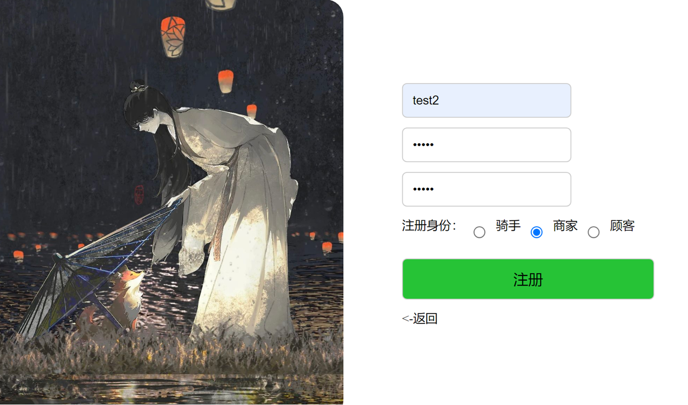
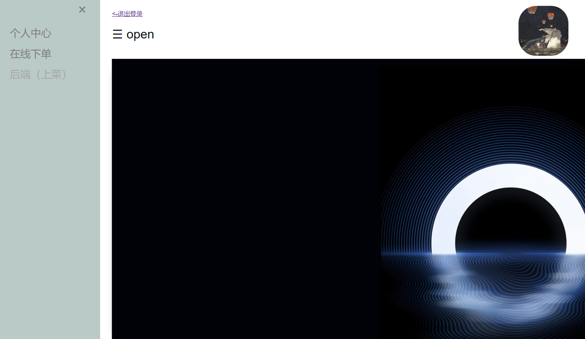
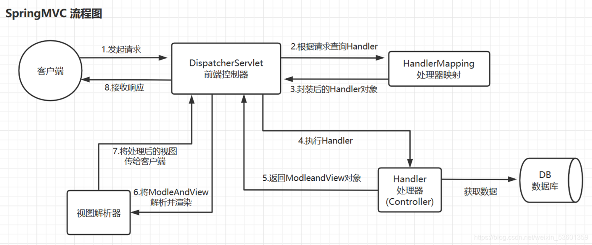

**前端使用vscode的live server插件或者其他可以被浏览器代理的方法打开，才可以使用浏览器管理cookie相应的功能**

1. 系统可以根据进入者的身份展现不同的功能
2. 通用功能有看个人信息、修改个人信息（包括密码）查看和自己相关的订单信息
3. 商家可以上架和下架商品，但不能使用下单功能
4. 用户对订单的操作主要有，下单、退订和确认收货，但使用不了和商家有关的操作
5. 外卖员可以抢单，还有可以选择可以抢的订单，查看自己抢到的单的信息

- 登录页面

- 主页面

- 原理图

